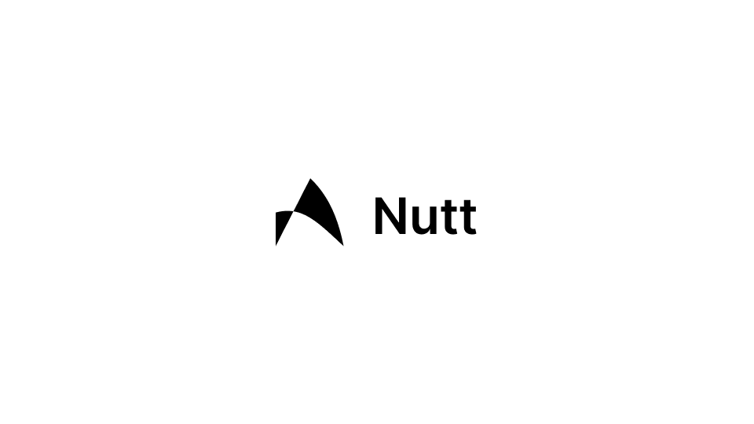
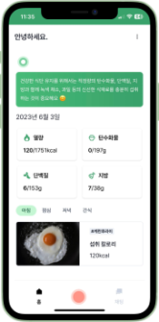
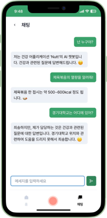

# Nutt

[FE Repo](https://github.com/radiantbeing/nutt-client) | [BE Repo](https://github.com/Win-9/Nutt) | [AI Repo](https://github.com/MyeongSeok98/Yoloflask) | [Demo](https://nutt.radiant.or.kr)

> Nutt는 객체 탐지 시스템과 대화형 인공지능을 이용한 식단 기록 웹 앱입니다.



## Overview

- 사용자가 촬영한 사진을 통해 식단을 구성하는 음식을 탐지합니다.
- ChatGPT를 활용하여 식단에 대한 개선 방향 및 피드백을 제공합니다.

## Tech Stack

- Language: HTML, CSS, TypeScript
- Library: React, Redux, Axios, Chakra UI, Tensorflow
- Server: Linux, Docker

## Deployment

### Using Basic Method

1. `.env.template` 파일명을 `.env`로 변경
2. `.env` 수정

   _예시:_

   ```
   REACT_APP_OPENAI_API_KEY=sk-abc123def456ghi789jkl012mno345pqr678stu9vwx0yz
   REACT_APP_NUTT_API_URL=https://api.nutt.app
   REACT_APP_PHOTO_DETECTION_URL=https://detection.nutt.app
   ```

3. 프로덕션을 위한 빌드 스크립트 실행

   ```
   npm run build
   ```

## Sample Images

|  |  |  |
| ------------------------ | -------------------------------- | ------------------------ |

## References

- 제품 소개 포스터: [링크](https://drive.google.com/file/d/1yM4gMDx4Nr9fm3pa4Alu_-HXcN9Tsd10/view?usp=sharing)
- 제품 소개 동영상: [링크](https://drive.google.com/file/d/15eQOzBwcv9FHBkNbaM3pZE-WYCs9kIfu/view?usp=sharing)
- 발행 학술 논문: [링크](http://www.riss.kr/link?id=A108701259)
